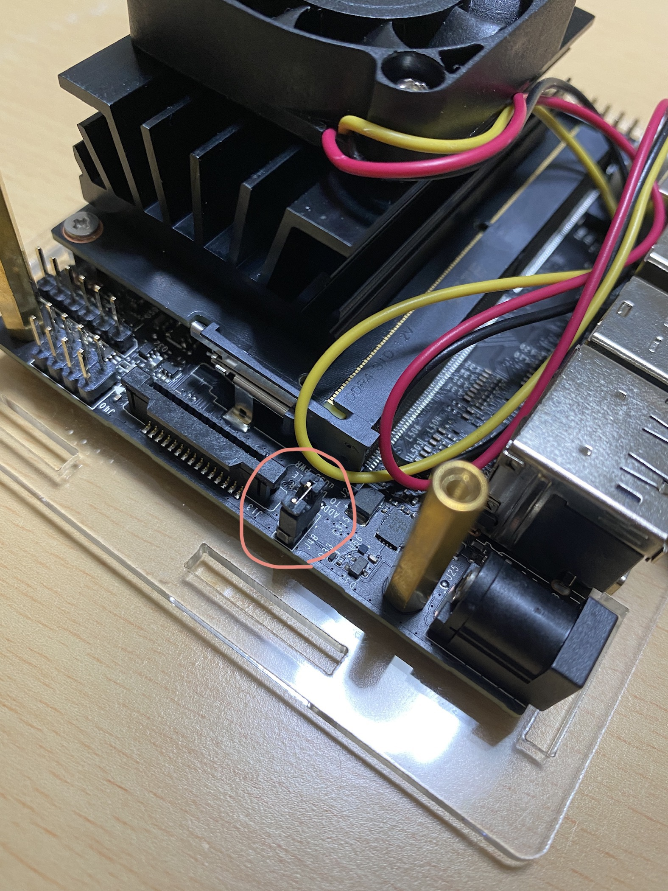

# Jetson Nano Setup

# Getting Started
[Gettig Started With Jetson Nano Developer Kit](https://developer.nvidia.com/embedded/learn/get-started-jetson-nano-devkit)

You can setup Jetson Nano following the above Getting Started guide.

# Power Supply
There are two options for power supply:
- micro USB (5V/2A) (*default*)
- DC (5V/4A)

Micro USB power supply is a default power supply.

To switch the power supply to DC, shorten these pins with a jumper pin.




# WiFi
Jetson Nano doesn't have any wireless module including WiFi and Bluetooth.
You need to prepare WiFi module if you connect to wifi.


You have two options for wifi modules:
- USB dongle
- [Intel Dual Band Wireless AC 8265](https://www.intel.co.jp/content/www/jp/ja/products/wireless/wireless-products/dual-band-wireless-ac-8265.html)

Jetson Nano supports many common USB wifi adapters.
Here we use [tp-link Archer T2U](https://www.tp-link.com/jp/home-networking/adapter/archer-t2u/) as a wifi USB dongle.

## Install WiFi Driver
[How to install tp-link Archer T2U on Ubuntu](https://peshmerge.io/how-to-install-tp-link-archer-t2u-mini-wireless-adapter-on-ubuntu-20-04/)

To install wifi driver of tp-link Archer T2U, clone [this repository](https://github.com/aircrack-ng/rtl8812au.git) and run a shell scpript.
```
$ sudo apt install dkms
$ git clone https://github.com/aircrack-ng/rtl8812au.git
$ cd rtl8812au
$ sudo make dkms_install
$ sudo reboot
```

# OpenCV
**darknet_ros** for ROS Melodic needs OpenCV version before **3.4.0**.
OpenCV 4.X.X is initially installed in Jetson Nano Developer Kit, so you need to replace 4.X.X to 3.4.0(or before).
Here we show how to replace OpenCV v4.X.X to v3.4.0 in Jetson Nano.

#### References
- https://github.com/jkjung-avt/jetson_nano
- https://www.usagi1975.com/201907162333/

## Check The OpenCV version
Check the current OpenCV verions by this command.
```
pkg-config --modversion opencv
```

## Install OpenCV 3.4.0 and Remove 4.X.X
1. Create `install_opencv_3.4.0.sh` and copy and paste following script to it.
2. Then, run this script.
```
$ sudo chmod +x install_opencv_3.4.0.sh
$ sudo ./install_opencv_3.4.0.sh
```
3. Link to `/usr/include`:
   - `ln -s /usr/local/include/opencv /usr/include/opencv`
   - `ln -s /usr/local/include/opencv2 /usr/include/opencv2`
4. Remove OpenCV 4.X.X packages.
   - `sudo rm -rf /usr/include/opencv4`
   - `sudo rm -rf /usr/local/lib/cmake/opencv4`

### `install_opencv_3.4.0.sh`
```bash
#!/bin/bash
#
# Copyright (c) 2018, NVIDIA CORPORATION.  All rights reserved.
#
# NVIDIA Corporation and its licensors retain all intellectual property
# and proprietary rights in and to this software, related documentation
# and any modifications thereto.  Any use, reproduction, disclosure or
# distribution of this software and related documentation without an express
# license agreement from NVIDIA Corporation is strictly prohibited.
#

# The orginal script 'install_opencv4.0.0_Nano.sh' could be found here:
# https://github.com/AastaNV/JEP/blob/master/script/install_opencv4.0.0_Nano.sh
#
# I did some modification so that it installs opencv-3.4.6 instead.  Refer
# to my blog posts for more details.
#
# JK Jung, jkjung13@gmail.com

set -e

chip_id=$(cat /sys/module/tegra_fuse/parameters/tegra_chip_id)
case ${chip_id} in
  "33" )  # Nano and TX1
    cuda_compute=5.3
    ;;
  "24" )  # TX2
    cuda_compute=6.2
    ;;
  "25" )  # AGX Xavier
    cuda_compute=7.2
    ;;
  * )     # default
    cuda_compute=5.3,6.2,7.2
    ;;
esac

py3_ver=$(python3 -c "import sys; print(sys.version_info[1])")

opencv_version=3.4.0
folder=${HOME}/src/opencv-build/
mkdir -p $folder

echo "** Purge old opencv installation"
sudo apt-get purge -y libopencv*

echo "** Install requirements"
sudo apt-get update
sudo apt-get install -y build-essential make cmake cmake-curses-gui git g++ pkg-config curl
sudo apt-get install -y libavcodec-dev libavformat-dev libavutil-dev libswscale-dev libeigen3-dev libglew-dev libgtk2.0-dev
sudo apt-get install -y libtbb2 libtbb-dev libv4l-dev v4l-utils qv4l2 v4l2ucp
sudo apt-get install -y libdc1394-22-dev libxine2-dev libgstreamer1.0-dev libgstreamer-plugins-base1.0-dev
# sudo apt-get install -y libjasper-dev
sudo apt-get install -y libjpeg8-dev libjpeg-turbo8-dev libtiff-dev libpng-dev
sudo apt-get install -y libxvidcore-dev libx264-dev libgtk-3-dev
sudo apt-get install -y libatlas-base-dev libopenblas-dev liblapack-dev liblapacke-dev gfortran
sudo apt-get install -y qt5-default

sudo apt-get install -y python3-dev python3-testresources
rm -f $folder/get-pip.py
wget https://bootstrap.pypa.io/get-pip.py -O $folder/get-pip.py
sudo python3 $folder/get-pip.py
sudo pip3 install protobuf
sudo pip3 install -U numpy matplotlib

if [ ! -f /usr/local/cuda/include/cuda_gl_interop.h.bak ]; then
  sudo cp /usr/local/cuda/include/cuda_gl_interop.h /usr/local/cuda/include/cuda_gl_interop.h.bak
fi
sudo patch -N -r - /usr/local/cuda/include/cuda_gl_interop.h < opencv/cuda_gl_interop.h.patch && echo "** '/usr/local/cuda/include/cuda_gl_interop.h' appears to be patched already.  Continue..."

echo "** Download opencv-${oepncv_version}"
cd $folder
if [ ! -f opencv-$opencv_version.zip ]; then
  wget https://github.com/opencv/opencv/archive/$opencv_version.zip -O opencv-$opencv_version.zip
fi
if [ -d opencv-$opencv_version ]; then
  echo "** ERROR: opencv-${opencv_version} directory already exists"
  exit
fi
unzip opencv-$opencv_version.zip
cd opencv-$opencv_version/

echo "** Building opencv..."
mkdir build
cd build/

cmake -D CMAKE_BUILD_TYPE=RELEASE -D CMAKE_INSTALL_PREFIX=/usr/local \
      -D WITH_CUDA=ON -D CUDA_ARCH_BIN=${cuda_compute} -D CUDA_ARCH_PTX="" \
      -D WITH_CUBLAS=ON -D ENABLE_FAST_MATH=ON -D CUDA_FAST_MATH=ON \
      -D ENABLE_NEON=ON -D WITH_GSTREAMER=ON -D WITH_LIBV4L=ON \
      -D BUILD_opencv_python2=OFF -D BUILD_opencv_python3=ON \
      -D BUILD_TESTS=OFF -D BUILD_PERF_TESTS=OFF -D BUILD_EXAMPLES=OFF \
      -D WITH_QT=ON -D WITH_OPENGL=ON ..
make -j$(nproc)
sudo make install
sudo ldconfig

python3 -c 'import cv2; print("python3 cv2 version: %s" % cv2.__version__)'

echo "** Install opencv-${opencv_version} successfully"
```


# References

## YOLO (Original)
[【物体検出】vol.2 ：YOLOv3をNVIDIA Jetson Nanoで動かす](https://www.nakasha.co.jp/future/ai/vol2_yolov3nvidia_jetson_nano.html)

### Download
First, clone the repository and download weights.
```
# Clone the repository
$ git clone https://github.com/AlexeyAB/darknet
$ cd darknet

# Download weights
$ wget https://pjreddie.com/media/files/yolov3.weights
$ wget https://pjreddie.com/media/files/yolov3-tiny.weights
```

### Modify Makefile
Modify Makefile to enable GPU, CUDA and OpenCV.
Set the value:
```
GPU=1
CUDNN=1
OPENCV=1
```
Activate Tegra X1 (GPU of Jetson Nano) by uncommenting:
```
ARCH= -gencode arch=compute_30,code=sm_30 \
-gencode arch=compute_35,code=sm_35 \
-gencode arch=compute_50,code=[sm_50,compute_50] \
-gencode arch=compute_52,code=[sm_52,compute_52] \
# -gencode arch=compute_61,code=[sm_61,compute_61]　


# For Jetson TX1, Tegra X1, DRIVE CX, DRIVE PX - uncomment:
ARCH= -gencode arch=compute_53,code=[sm_53,compute_53]
```

### Export PATH
```
$ export PATH=/usr/local/cuda/bin:${PATH}
$ export LD_LIBRARY_PATH=/usr/local/cuda/lib64:${LD_LIBRARY_PATH}
```

### Make
```
$ make
```

### Demo
```
$ ./darknet detector demo cfg/coco.data cfg/yolov3-tiny.cfg yolov3-tiny.weights -c 0
```
### Memo
$ nvgstcapture
$ ./darknet detector demo cfg/coco.data cfg/yolov3-tiny.cfg yolov3-tiny.weights "'nvarguscamerasrc ! video/x-raw(memory:NVMM), width=1920, height=1080, format=(string)NV12, framerate=(fraction)30/1 ! nvtee ! nvvidconv flip-method=2 ! video/x-raw, width=(int)1280, height=(int)720, format=(string)BGRx ! videoconvert ! appsink'"


## PyTorch-YOLOv3
[pytorch-yolo-v3](https://github.com/ayooshkathuria/pytorch-yolo-v3)

### Install PyTorch
[PyTorch for Jetson Nano](https://forums.developer.nvidia.com/t/pytorch-for-jetson-nano-version-1-6-0-now-available/72048)
> The JetPack 4.4 production release (L4T R32.4.3) only supports PyTorch 1.6.0 or newer, due to updates in cuDNN.

#### Python 3.6
```
$ wget https://nvidia.box.com/shared/static/9eptse6jyly1ggt9axbja2yrmj6pbarc.whl -O torch-1.6.0-cp36-cp36m-linux_aarch64.whl
$ sudo apt-get install python3-pip libopenblas-base libopenmpi-dev
$ pip3 install Cython
$ pip3 install numpy torch-1.6.0-cp36-cp36m-linux_aarch64.whl
```
#### torchvision
```
$ sudo apt-get install libjpeg-dev zlib1g-dev
$ git clone --branch <version> https://github.com/pytorch/vision torchvision   # see below for version of torchvision to download
$ cd torchvision
$ sudo python setup.py install    # use python3 if installing for Python 3.6
$ cd ../  # attempting to load torchvision from build dir will result in import error
$ pip install 'pillow<7' # always needed for Python 2.7, not needed torchvision v0.5.0+ with Python 3.6
```
