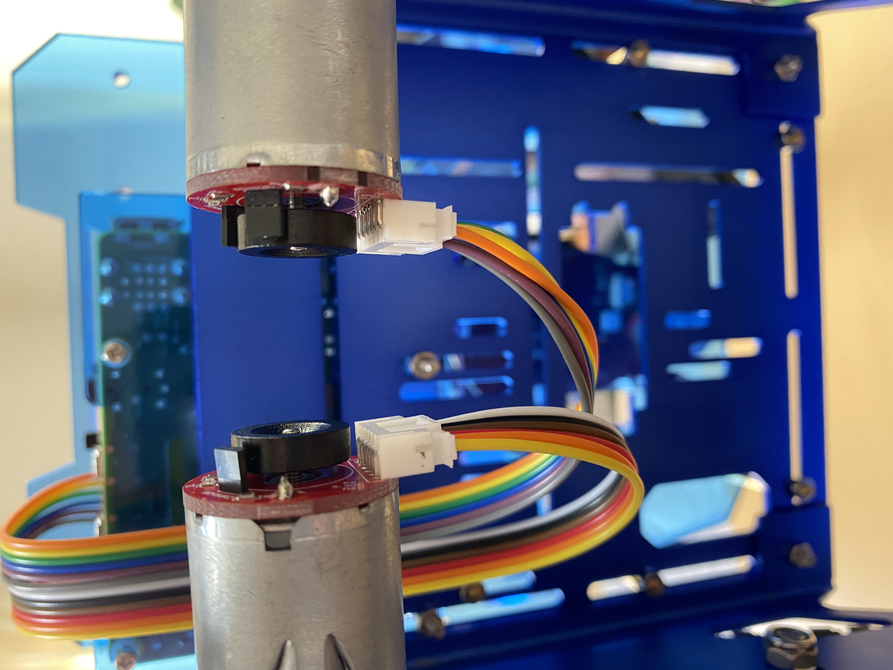
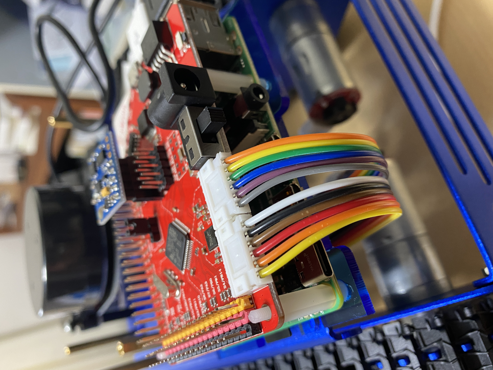
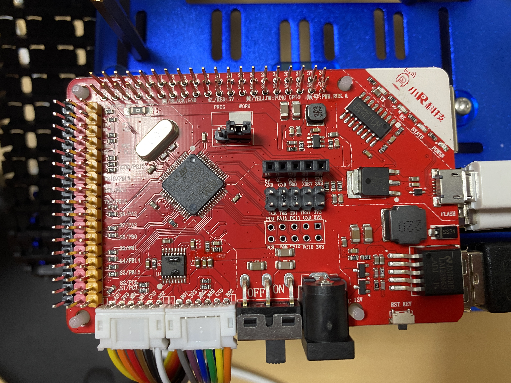
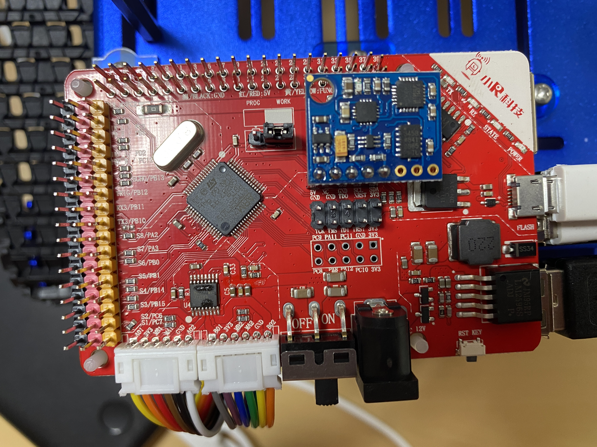
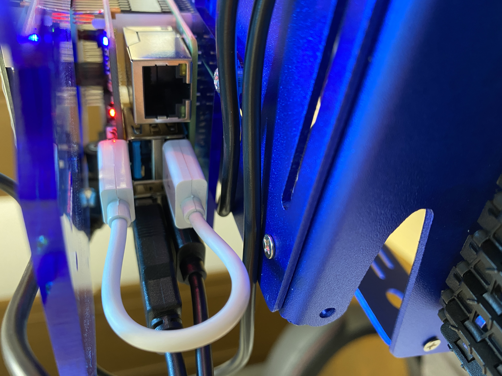
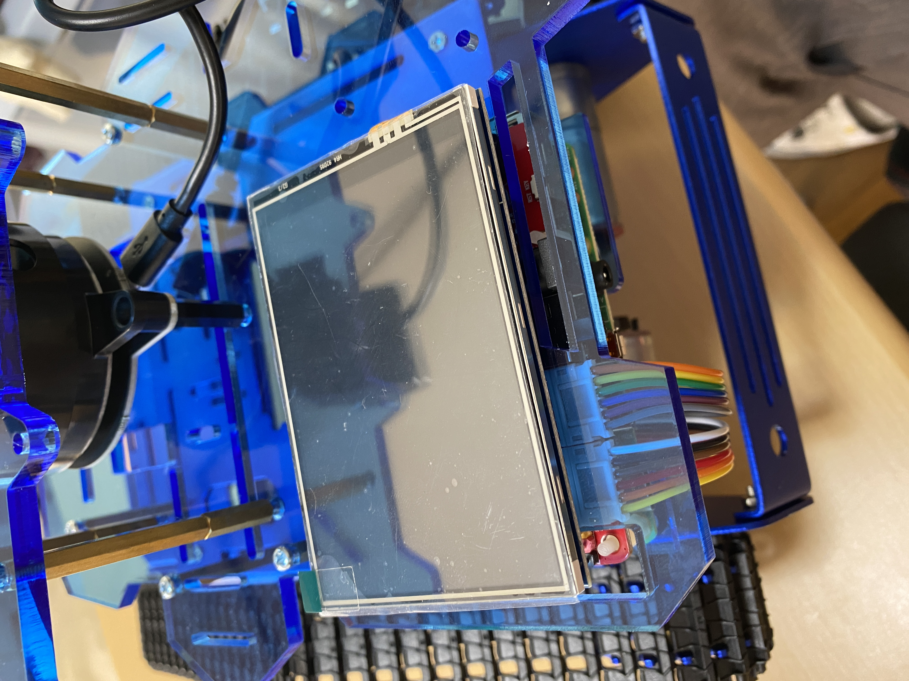
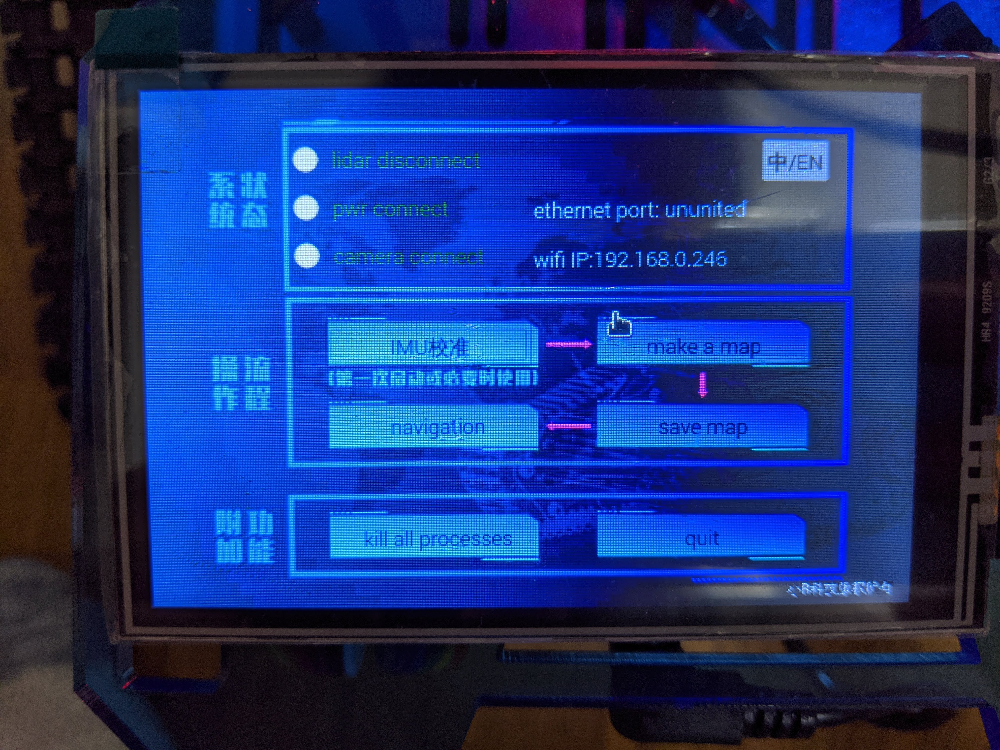

# Xiaor Robot (LiDAR Robot) Installation
## Wiring
### Motor Connection

### IMU Sensor

### Board Power Supply
Connect micro-USB to the board.

### Display
At last, connect the display to the board.

## Raspberry Pi Setup
### WiFi
First of all, you have to connect to WiFi network.

Push `quit` button at the right bottom in the menu screen.

You'll see a desktop in the screen.
Touch the WiFi mark and select your SSID you want to connect.

> **NOTE**:
> In the CASE Shinjuku office, you often use wifi which CASE provides, but you cannot use it because you cannot communicate TCP/IP over CASE wifi, which means you cannot communicate ROS nodes in the network.
>  Make sure you use your private wifi network including iPhone tethering.

Reboot Rraspberry Pi to come back to the application menu since how to run the application from the desktop is not certain.

Now you see wifi IP address in the menu screen.