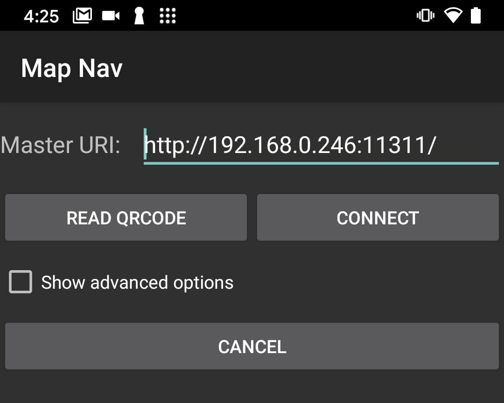
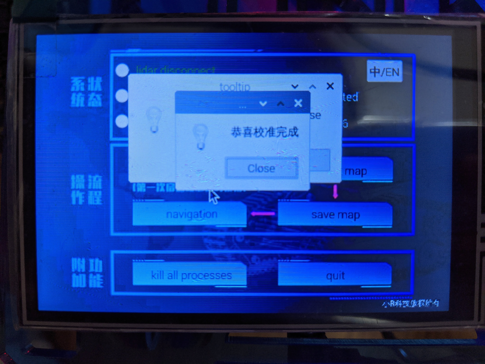
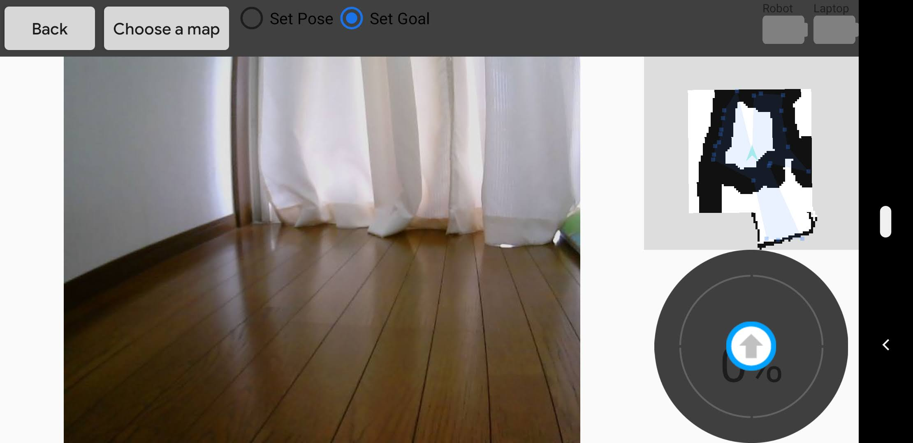
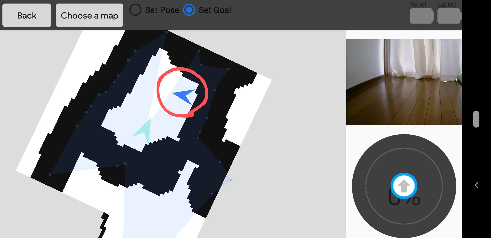
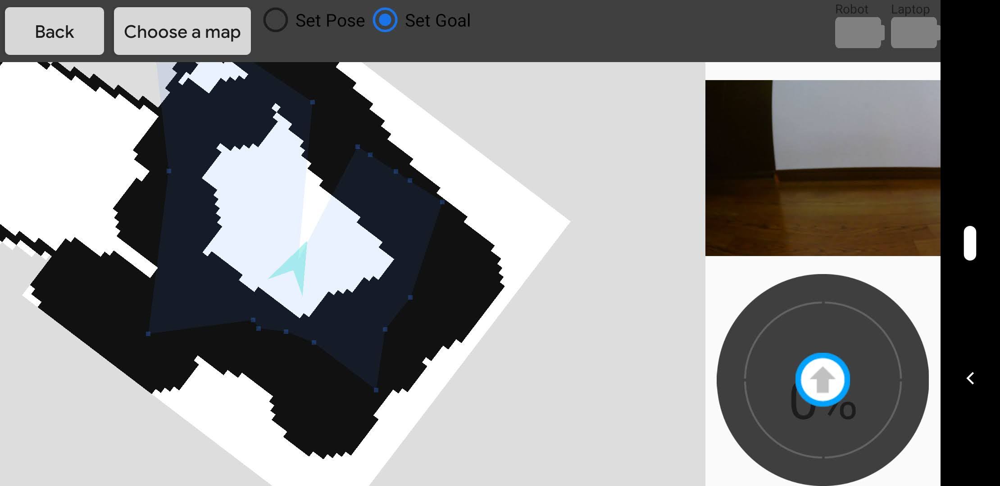

# SLAM Navigation
ROS.org provides map navigation app in [Google Play Store](https://play.google.com/store/apps/details?id=com.github.rosjava.android_apps.map_nav.kinetic&hl=ja).

[ROS wiki](http://www.ros.org/wiki/android_map_nav)

## Setup Tank
- It should be connected to Wi-Fi to run this application.

Turn on Tank and you'll see this menu window on the touch screen.
# Android App
Here, we describe how to use the SLAM Navigation app.
## Enter ROS Master URI
First you can see this screen.
Enter ROS Master URI, which is the IP address of the Tank.

Its port number is 11311.

# Setup Tank for Navigation
Turn on Tank and you'll see the menu window on the touch screen.
## 1. IMU Calibration
Touch IMU calibration command and calibrate IMU sensors.
Wait a while until calibration is completed.

You'll see this window when calibration is done.

## 2. Make a Map
Next, push `make a map` command and move the tank around by using virtual joystick on Android App to make a map.

## 3. Save a Map
Push `save map` command after moving around.

## 4. Navigation
Push `navigation` command at last.

# Navigation
After connecting to the ROS master, you can see the map and camera image like this.
The map window and camera image will swap if you touch the up-right window(in this picture, map window).

A blue arrow will appear when you press on the map.
You can change the direction by keeping pressing and move it around.

When you release your finger, Tank will move to the position you set.

